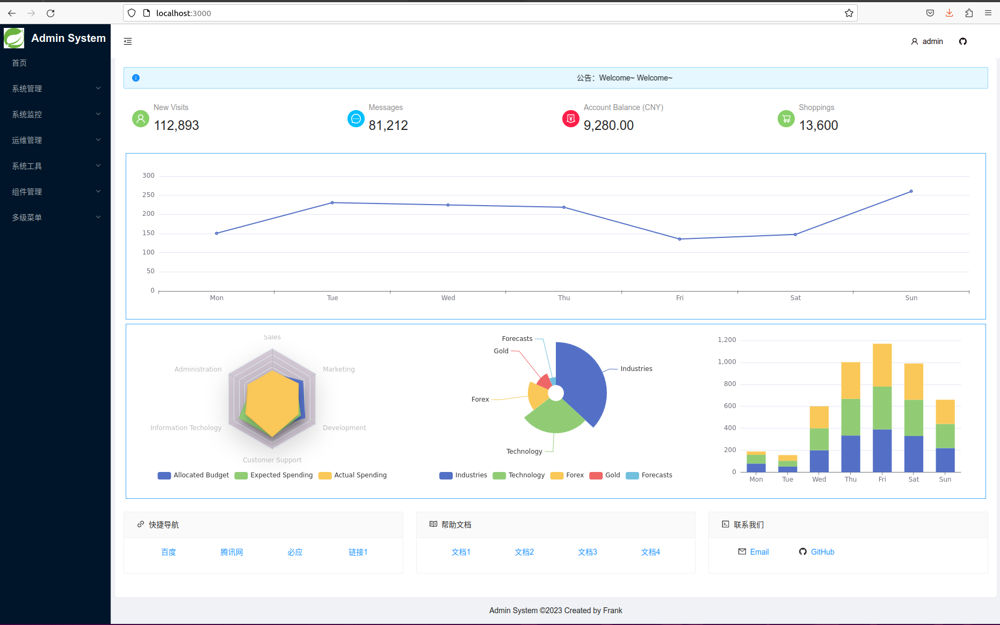

<h1 style="text-align: center">ELADMIN 后台管理前端（React）系统</h1>

<p align="center">
  <a href="https://github.com/facebook/react/">
    
  </a>
  <a href="https://nodejs.org/en">
    
  </a>
  <a href="https://www.npmjs.com" rel="nofollow">
    
  </a>
  <a href="https://github.com/RoboticsAndCloud/eladmin_web_react/blob/main/LICENSE">
    
  </a>
</p>

English | [简体中文](./README.md) 

## Introduction
- eladmin web system is a web interface based on React + React-Router + Antd + Echarts 
- Json-serve is adopted for mimicing the backed server. You need install a real `eladmin` server based on Spring-Boot, and change the API data structure of the Web system to communicate with each other

**Online Demo：**  [https://roboticsandcloud.github.io/eladmin_web_react](https://roboticsandcloud.github.io/eladmin_web_react)

**username/password：** `admin / admin`

**Source Code**

|   Backend  |   Frontend（Vue)  | Frontend（React) |
|--- | --- | --- |
|  https://github.com/elunez/eladmin   |  https://github.com/elunez/eladmin-web   |  https://github.com/RoboticsAndCloud/eladmin_web_react   

## Demo

<div align="center">
  





</div>

## Features

#### Complete
- 用户管理：提供用户的相关配置 
- 角色管理：对权限与菜单进行分配，可根据部门设置角色的数据权限

#### Developing
- 菜单管理：已实现菜单动态路由，后端可配置化，支持多级菜单
- 部门管理：可配置系统组织架构，树形表格展示
- 岗位管理：配置各个部门的职位
- 字典管理：可维护常用一些固定的数据，如：状态，性别等
- 系统日志：记录用户操作日志与异常日志，方便开发人员定位排错
- SQL监控：采用druid 监控数据库访问性能，默认用户名admin，密码123456
- 定时任务：整合Quartz做定时任务，加入任务日志，任务运行情况一目了然
- 代码生成：高灵活度生成前后端代码，减少大量重复的工作任务
- 邮件工具：配合富文本，发送html格式的邮件
- 七牛云存储：可同步七牛云存储的数据到系统，无需登录七牛云直接操作云数据
- 支付宝支付：整合了支付宝支付并且提供了测试账号，可自行测试
- 服务监控：监控服务器的负载情况
- 运维管理：一键部署你的应用


## Getting started

### Environment
- node v16.20.1
- npm v9.2.0

### Installation

```bash
$ git clone https://github.com/RoboticsAndCloud/eladmin_web_react.git
$ cd eladmin_web_react
$ npm install
$ npm run jsonserver # Launch the jsonserver, please check package.json for more details,"jsonserver": "json-server --watch db.json --host 10.227.96.160 --port 3004 --routes routes.json"

$ npm start   # URL: http://localhost:3000
```

## Supported Browsers

>  chrome is preferred

| [](http://godban.github.io/browsers-support-badges/)</br>IE / Edge | [](http://godban.github.io/browsers-support-badges/)</br>Firefox | [](http://godban.github.io/browsers-support-badges/)</br>Chrome | [](http://godban.github.io/browsers-support-badges/)</br>Safari | [](http://godban.github.io/browsers-support-badges/)</br>Opera |
| --- | --- | --- | --- | --- |
| IE11, Edge | last 2 versions | last 2 versions | last 2 versions | last 2 versions |

## Discussion

Any suggestions or contributions are welcome.

- If you like it，please [Star](https://github.com/RoboticsAndCloud/eladmin_web_react.git).
- If you want to contribute some codes，Please [Pull Request](https://github.com/RoboticsAndCloud/eladmin_web_react/pulls).

## Thanks

- Thank [phachon](https://github.com/phachon/ailu-admin) for the template of the frontend
- Thank [elunez](https://github.com/elunez/eladmin) for the template and system of the backend
