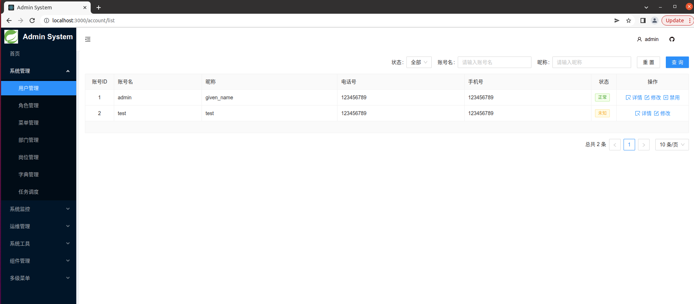
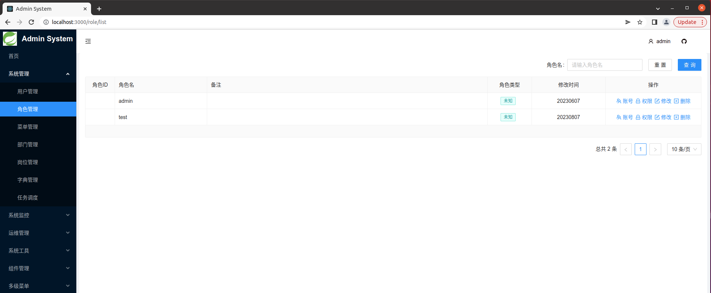

<h2 align="center">
  


</h2>

<div align="center">
  
eladmin 是一个基于 React + React-Router + Antd + Echarts 开发的后台管理系统 前端界面
</br>

[](https://raw.githubusercontent.com/phachon/ailu-admin/master/LICENSE)
[]()
[](https://github.com/phachon/ailu-admin/releases) 
[](https://github.com/phachon/ailu-admin/releases) 






</div>

## 功能

todo 开发中。。。


## 使用

### 环境
- node
- npm 

### 安装

```bash
$ https://github.com/phachon/ailu-admin.git
$ cd ailu-admin
$ npm install
$ npm start   # 浏览器访问 http://localhost:3000
```

## 浏览器支持

> 推荐使用 chrome 浏览器

| [](http://godban.github.io/browsers-support-badges/)</br>IE / Edge | [](http://godban.github.io/browsers-support-badges/)</br>Firefox | [](http://godban.github.io/browsers-support-badges/)</br>Chrome | [](http://godban.github.io/browsers-support-badges/)</br>Safari | [](http://godban.github.io/browsers-support-badges/)</br>Opera |
| --- | --- | --- | --- | --- |
| IE11, Edge | last 2 versions | last 2 versions | last 2 versions | last 2 versions |

## 交流&贡献

欢迎任何类型的贡献

- 如果您喜欢该项目，请 [Star](https://github.com/phachon/ailu-admin/stargazers).
- 如果在使用过程中有任何问题， 请提交 [Issue](https://github.com/phachon/ailu-admin/issues).
- 如果您发现并解决了bug，请提交 [Pull Request](https://github.com/phachon/ailu-admin/pulls).
- 如果您想二次开发，欢迎 [Fork](https://github.com/phachon/ailu-admin/network/members).

## License

MIT

Thanks
---

Created By phachon
